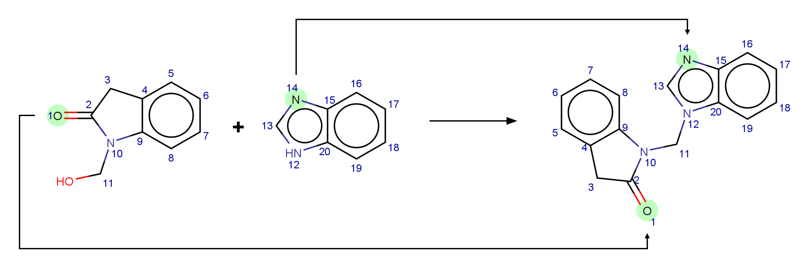

# Atom-to-atom Mapping
[](https://github.com/neo-chem-synth-wave/atom-to-atom-mapping/releases/tag/2025.5.2)
[](https://www.isct.ac.jp)
[](https://www.elix-inc.com)

Welcome to the chemical reaction compound **atom-to-atom mapping** research project !!!

A chemical reaction can be defined as the transformation of a set of chemical compounds into another. Accompanied by a
change in energy, the atoms of the reactant chemical compounds are rearranged to form the product chemical compounds,
with or without the assistance of spectator compounds. Correctly mapping this rearrangement of chemical compound atoms
is paramount for capturing the essence of the chemical reaction. This task, commonly referred to as atom-to-atom mapping
or atom mapping, has proven challenging as it is a generalization of the well-known subgraph isomorphism problem.
Consequently, the primary objective of the **Atom-to-atom Mapping** research project is to systematically curate and
facilitate access to relevant chemical reaction compound atom-to-atom mapping resources.




## Installation
An environment can be created using the [git](https://git-scm.com) and [conda](https://conda.io) commands as follows:

```shell
git clone https://github.com/neo-chem-synth-wave/atom-to-atom-mapping.git

cd atom-to-atom-mapping

conda env create -f environment.yaml

conda activate atom-to-atom-mapping-env
```

The [atom_to_atom_mapping](/atom_to_atom_mapping) package can be installed using the [pip](https://pip.pypa.io) command
as follows:

```shell
pip install .
```


### Environment Troubleshooting
According to [GitHub Issue 4](https://github.com/snu-micc/LocalMapper/issues/4) and
[GitHub Issue 5](https://github.com/snu-micc/LocalMapper/issues/5) on the
[LocalMapper](https://github.com/snu-micc/LocalMapper) repository, potential conflicts between the
[PyTorch](https://pytorch.org), [CUDA](https://developer.nvidia.com/cuda-toolkit), and [DGL](https://www.dgl.ai)
libraries may arise. To resolve the conflicts, the
[appropriate version of the DGL library](https://www.dgl.ai/pages/start.html) can be re-installed as follows:

```shell
# Re-install the DGL library for the PyTorch and CUDA library versions 2.4 and 12.1, respectively.

pip uninstall dgl

pip install dgl -f https://data.dgl.ai/wheels/torch-2.4/cu121/repo.html 
```


## Utilization
The purpose of the [scripts](/scripts) directory is to illustrate how to map chemical reaction compounds using the
following approaches:

1. Indigo <sup>[[1](#references)]</sup>
2. RXNMapper <sup>[[2](#references)]</sup>
3. Chytorch RxnMap <sup>[[3](#references)]</sup>
4. LocalMapper <sup>[[4](#references)]</sup>

The [map_reaction_smiles_strings](/scripts/map_reaction_smiles_strings.py) script can be utilized as follows:

```shell
# Map a chemical reaction SMILES string.

python scripts/map_reaction_smiles_strings.py \
  --atom_to_atom_mapping_approach "indigo" \
  --reaction_smiles "OCN1C(=O)Cc2ccccc12.c1nc2ccccc2[nH]1>>O=C1Cc2ccccc2N1Cn1cnc2ccccc12"
```

```shell
# Map the chemical reaction SMILES strings from a .csv file.

python scripts/map_reaction_smiles_strings.py \
  --atom_to_atom_mapping_approach "rxnmapper" \
  --input_csv_file_path "/path/to/the/input/file.csv" \
  --reaction_smiles_column_name "name_of_the_reaction_smiles_column" \
  --output_csv_file_path "/path/to/the/output/file.csv"
```


## License Information
The contents of this repository are published under the [MIT](/LICENSE) license. Please refer to the individual
references for more details regarding the license information of external resources utilized within the repository.


## Contact
If you are interested in contributing to this research project by reporting bugs, suggesting improvements, or submitting
feedback, feel free to do so using [GitHub Issues](https://github.com/neo-chem-synth-wave/atom-to-atom-mapping/issues).


## Acknowledgements
Marvin was used for drawing, displaying and characterizing chemical structures, substructures and reactions.
<sup>[[5](#references)]</sup>


## References
**[[1](https://lifescience.opensource.epam.com/indigo/index.html)]** **EPAM Indigo**:
https://lifescience.opensource.epam.com/indigo/index.html. Accessed on: 2025/05/04.

**[[2](/references/2021/20210407_schwaller_p_et_al.md)]** Schwaller, P., Hoover, B., Reymond, J., Strobelt, H., and
Laino, T. **Extraction of Organic Chemistry Grammar from Unsupervised Learning of Chemical Reactions**. _Sci. Adv._, 7,
eabe4166, 2021.

**[[3](/references/2022/20220706_nugmanov_r_et_al.md)]** Nugmanov, R., Dyubankova, N., Gedich, A., and Wegner, J.K.
**Bidirectional Graphormer for Reactivity Understanding: Neural Network Trained to Reaction Atom-to-atom Mapping Task**.
_J. Chem. Inf. Model._, 2022, 62, 14, 3307–3315.

**[[4](/references/2024/20240313_chen_s_et_al.md)]** Chen, S., An, S., Babazade, R., and Jung, Y. **Precise Atom-to-atom
Mapping for Organic Reactions via Human-in-the-loop Machine Learning**.  _Nat. Commun._, 15, 2250, 2024.

**[[5](https://chemaxon.com)]** **Marvin 24.3.1, 2025, ChemAxon**: https://chemaxon.com. Accessed on: 2025/05/04.
